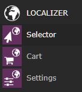
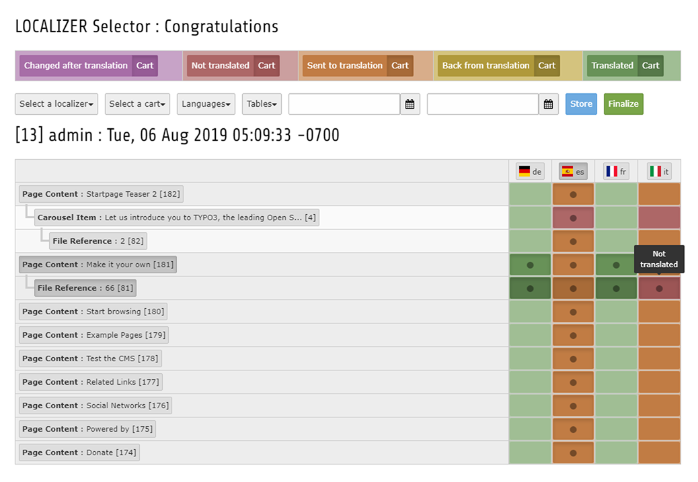
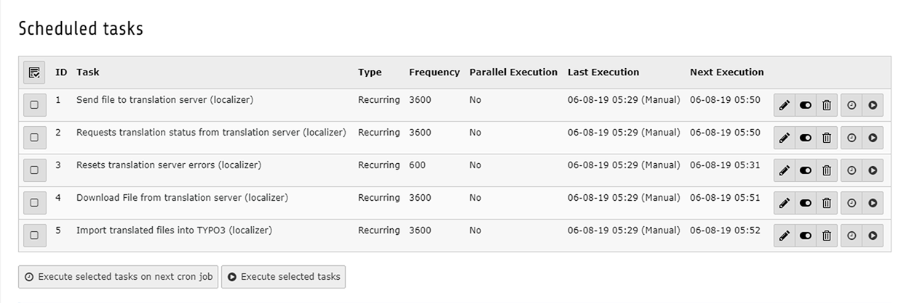
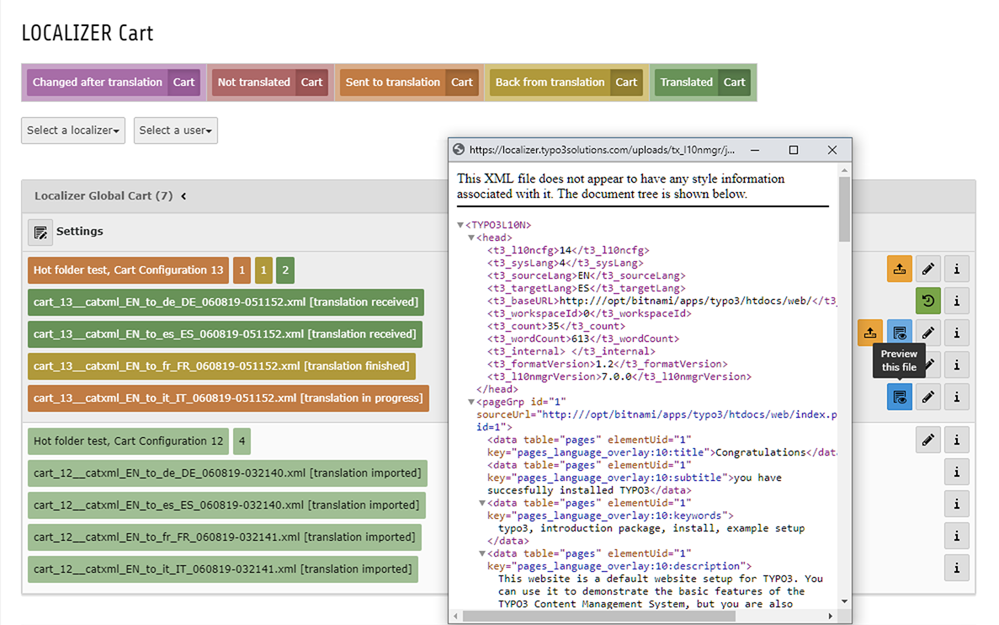

.. include:: ../Includes.txt

.. _for-editors:

===========
For Editors
===========

To create a new translation task with the Localizer go to the section LOCALIZER in your module menu and click on the Selector

.. _figure0:

   Localizer Modules

After the selector module has opened, you have to select a page from the page tree, since each translation process needs at least one page record to be working on.

Now you can select one of the available Localizers for your translation tasks. If there is only one, you can proceed to the next step without selecting one.

.. _figure1:

   Localizer Selector

.. _figure2:

   Scheduler Tasks

.. _figure3:

   Localizer Cart